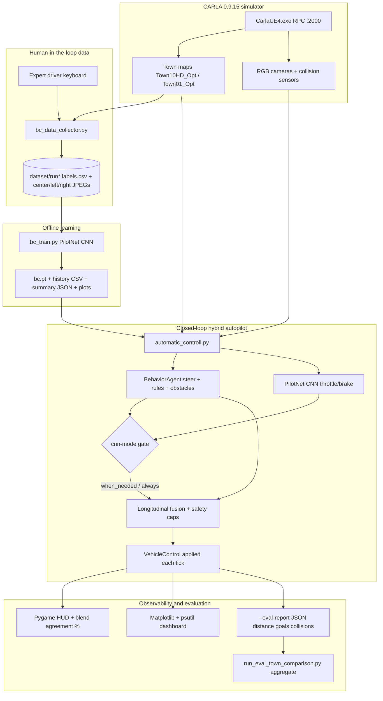
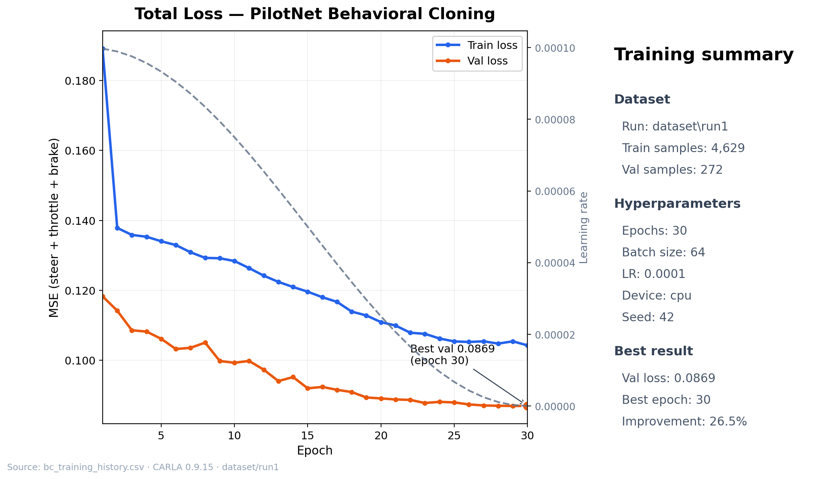
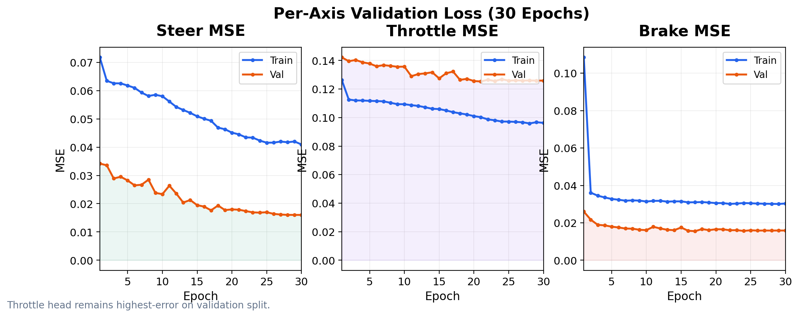
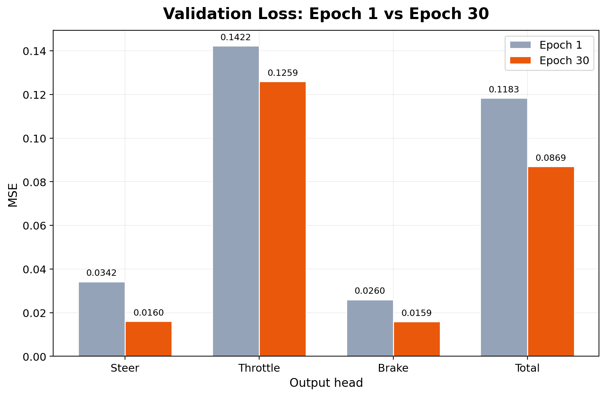
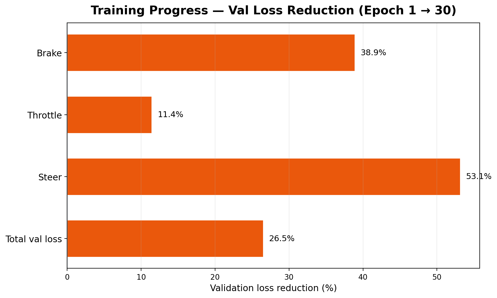
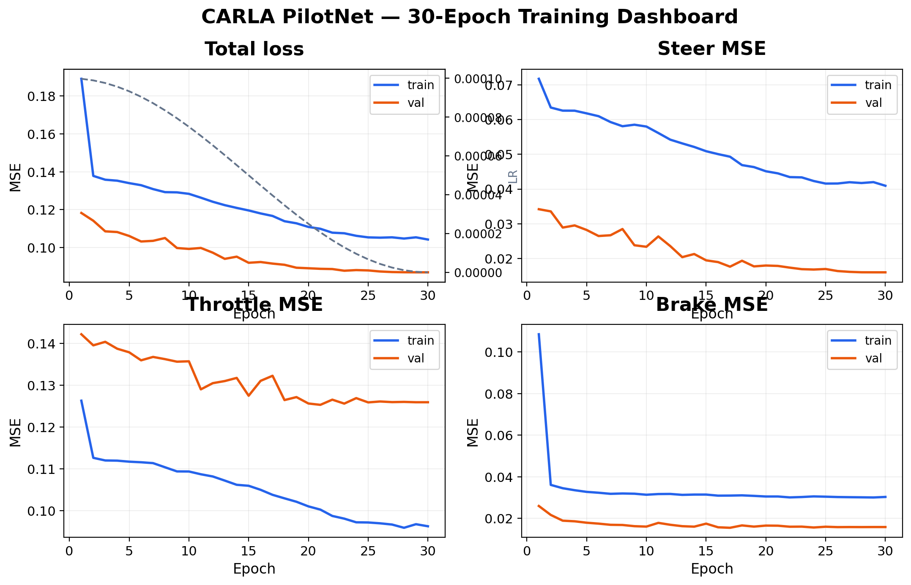
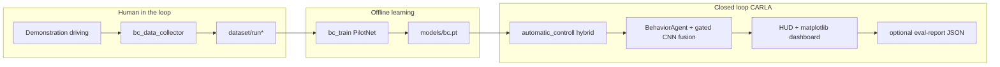

> **Repo layout:** Script sources live in [examples/](./examples/). Training outputs such as models/bc.pt are created locally and are **not** committed here.

# An interpretable autonomous driving system with human in the loop learning and uncertainty awareness

**Simulator stack:** [CARLA](https://carla.org/) 0.9.15 (Windows packaged build, Python API examples under `examples/`).

This document is the **full project reference**: system architecture, training metrics, presentation plots, closed-loop evaluation results (Town10 vs Town01), and reproducible commands. Script sources live under `examples/`; a GitHub mirror is at [CARLA-AV-Simulation-With-CNN-BehaviorAgent](https://github.com/Aejazzz/CARLA-AV-Simulation-With-CNN-BehaviorAgent.git).

---

## Abstract (project framing)

The system combines a **transparent rule- and planner-based layer** (CARLA `BehaviorAgent`) with a **human-demonstration-trained PilotNet-style CNN** for longitudinal (and optionally fused) control. **Human-in-the-loop learning** denotes recording expert trajectories (`bc_data_collector.py`), curating demonstrations, and retraining (`bc_train.py`). **Uncertainty awareness**, in this implementation, surfaces as **explicit operational cues** rather than calibrated Bayesian uncertainty: hybrid gating (`--cnn-mode when_needed`), longitudinal fusion rules, and a **blend-agreement heuristic** on the HUD (see Limitations)—so operators can judge when neural and symbolic policies disagree.

---

## System architecture

Hybrid stack: **BehaviorAgent** (symbolic planner + traffic rules) handles steering and safety; **PilotNet CNN** (behavioral cloning) optionally fuses longitudinal throttle/brake when the scene is “easy” (`--cnn-mode when_needed`).



### Component roles

| Layer | Module | Responsibility |
|-------|--------|----------------|
| **Simulator** | `CarlaUE4.exe`, `config.py` | Maps, physics, sensors, sync mode |
| **Data** | `bc_data_collector.py`, `bc_dataset.py` | Record demos; 3-camera stack, resize 200×66 |
| **Model** | `bc_model.py`, `bc_train.py` | PilotNet CNN (252k params); steer/throttle/brake regression |
| **Symbolic policy** | `automatic_control.py` → `BehaviorAgent` | Route planning, traffic lights, obstacle avoidance, steering |
| **Neural policy** | `automatic_controll.py` + `bc.pt` | Longitudinal CNN; gated fusion with agent |
| **Evaluation** | `--eval-report`, `run_eval_town_comparison.py` | Closed-loop metrics; Town10 vs Town01 batch |
| **Reporting** | `generate_training_presentation_plots.py` | Slide-ready PNGs from training CSV |

---

## Visual summary

### Runtime UI (schematic)

| Figure | Contents | Path |
|--------|----------|------|
| **Matplotlib dashboard** | Speed, steer, throttle/brake, collision, agent strip | `project_docs/figures/dashboard_matplotlib.png` |
| **Pygame HUD** | Dark-theme in-game overlay + PilotNet block | `project_docs/figures/pygame_hud.png` |


### Training results — presentation plots (30 epochs, dataset/run1)

Generated by `generate_training_presentation_plots.py` from `models/bc_training_history.csv`.

| Slide | Contents | Path |
|-------|----------|------|
| **Total loss + summary** | Train/val curve, LR schedule, hyperparameters | `project_docs/presentation/01_total_loss_summary.png` |
| **Per-axis loss** | Steer / throttle / brake MSE over epochs | `project_docs/presentation/02_per_axis_loss.png` |
| **Epoch 1 vs 30** | Validation bar chart before/after | `project_docs/presentation/03_val_epoch1_vs_30.png` |
| **Improvement %** | Val loss reduction per output head | `project_docs/presentation/04_val_improvement_pct.png` |
| **Full dashboard** | 2×2 loss panels (matches `bc_train.py` layout) | `project_docs/presentation/05_training_dashboard.png` |











Regenerate plots after a new training run:

```powershell
cd examples
python generate_training_presentation_plots.py
```

---

## Contributions at a glance

| Theme | Mechanism in this repo |
|--------|-------------------------|
| **Interpretability** | `BehaviorAgent` exposes coarse **behavior presets** (`cautious`, `normal`, `aggressive`); HUD shows kinematics, map, collisions, GNSS; optional CNN block shows gated fusion and blend agreement—not a single opaque end-to-end policy. |
| **Human-in-the-loop** | `bc_data_collector.py`: human drives → synchronized cameras + `labels.csv` → offline training (`bc_train.py`). |
| **Uncertainty awareness** | **Operational:** CNN used only under **when_needed** thresholds (speed, steer, brake caps); HUD **blend-agreement %** contrasts CNN vs agent pedals **where fused** (`automatic_controll.py`). This is **not** a softmax “confidence” or calibrated risk score. |

---

## System workflow



1. **Start CARLA:** `WindowsNoEditor\CarlaUE4.exe` (RPC default `127.0.0.1:2000`).
2. **Map (example):** `PythonAPI\util\config.py -m Town10HD_Opt` (or `Town01` for comparison runs).
3. **Collect data:** `python bc_data_collector.py --output dataset\run_townXX_01` (press **R** to record).
4. **Train:** `python bc_train.py --data dataset --epochs 30 --batch-size 64 --out models\bc.pt`
5. **Deploy:** `python automatic_controll.py --model models\bc.pt --cnn-mode when_needed`
6. **Evaluate:** `python automatic_controll.py --model models\bc.pt --eval-report eval\townXX_run01.json` (aggregate success metrics from JSON folder).

Optional **Hugging Face** streaming baseline: `bc_train_hf_stream.py` (datasets often biased toward towns and conditions present in hosted CARLA imitation sets—typically **dense layouts closer to Town10-style diversity**).

---

## Metrics reference

### Training metrics (offline)

| Metric | Meaning | Typical location |
|--------|---------|------------------|
| `train_loss` / `val_loss` | Scalar regression loss over steer, throttle, brake targets | `models/bc_training_history.csv` |
| `train_steer`, `val_steer`, … | Per-axis MSE-style components | Same CSV columns |
| `best_val_loss`, `best_epoch` | Checkpoint selection criterion | `models/bc_training_summary.json` |
| Learning rate | Cosine schedule per epoch | `lr` column in CSV |

### Runtime / observation metrics (HUD + dashboard)

From `automatic_control.py` extensions and HUD:

| Category | Signals |
|-----------|---------|
| **Simulation** | Server FPS, client FPS, elapsed simulation time |
| **Ego kinematics** | Speed (km/h), heading (°), position, GNSS lat/lon, height |
| **Controls** | Throttle / steer / brake bars, gear, reverse, hand brake |
| **Safety / interaction** | Collision intensity history strip; lane invasion notifications |
| **Context** | Map name; nearby vehicles within ~200 m |
| **Analytics window** | Time series: speed, steer, throttle, brake, collision intensity; rolling CPU/RAM; distance-to-goal, agent mode/target speed |

### Closed-loop evaluation (`--eval-report`)

| Field (JSON) | Use |
|----------------|-----|
| `distance_driven_m` | Odometer-style distance |
| `time_to_first_collision_s` | First collision latency or `null` |
| `goals_reached` | Destination completions (can exceed 1 with `--loop`) |
| `collision_events` | Count of collision impulses |
| `duration_s`, `map_name`, `outcome` | Session metadata |

**Operational success rate (define explicitly):**

- Example: \(\text{success} = \mathbb{1}[\texttt{goals\_reached} \geq 1 \land \texttt{collision\_events} = 0]\) per session, then mean over \(N\) runs.
- Alternative: tolerate late collision; declare your criterion next to reported numbers.

---

## Recorded training & validation loss (artifacts in repo)

The following rows are copied from **`examples/models/bc_training_summary.json`** and **`bc_training_history.csv`** produced by `bc_train.py` (dataset: `dataset\run1`, seed `42`, 30 epochs, batch 64, CPU).

### Summary

| Item | Value |
|------|--------|
| **Train label rows** | 1 543 |
| **Train samples** (3-camera stack) | 4 629 |
| **Validation label rows** | 272 |
| **Validation samples** | 272 |
| **Model parameters** | 252 241 |
| **Best epoch (by validation loss)** | 30 |
| **Best validation loss** | **0.086934** |
| **Train loss @ best epoch** | **0.104253** |

### Learning dynamics (selected epochs)

| Epoch | Train loss | Val loss | Val steer | Val throttle | Val brake |
|-------|------------|----------|-----------|----------------|-----------|
| 1 | 0.1891 | 0.1183 | 0.0342 | 0.1422 | 0.0260 |
| 10 | 0.1284 | 0.0993 | 0.0234 | 0.1357 | 0.0161 |
| 20 | 0.1109 | 0.0891 | 0.0180 | 0.1256 | 0.0166 |
| 30 | 0.1043 | **0.0869** | 0.0160 | 0.1259 | 0.0159 |

Trend: **steady reduction** in validation loss early, then refinement in late epochs Cosine tails; braking head remains relatively **highest-error axis** versus steer on validation splits—useful diagnostic for imbalance or scarce brake samples in demos.

Generate updated plots anytime:

```bash
cd examples
pip install -r bc_requirements.txt
python bc_train.py --data dataset --epochs 30 --batch-size 64 --out models/bc.pt
python generate_training_presentation_plots.py
# Produces CSV, JSON, bc_training_curves.png, and project_docs/presentation/*.png
```

---

## Comparative analysis: Town10 vs Town01 & data availability

### Empirical hypothesis (distribution shift)

Large **public imitation-learning bundles** on the web and models such as streamed **Hugging Face CARLA-style datasets** are often dominated by recordings from **dense, complex urban meshes**—closer to **Town10HD_Opt-like** richness (multi-lane traffic, ramps, heterogeneous actors). PilotNet minimizes **behavioral cloning loss** on that distribution; when you **deploy in Town10**, the **train–test gap is smaller**, so the CNN’s longitudinal proposals align more often with the agent, and **validation-style errors** translate more reliably to **smooth progress** toward goals.

**Town01** is a **simpler, sparser** layout with different lane widths, semantics, and traffic patterns. If your **HitL logs** (or HF stream) under-represent that geometry, the CNN sees **covariate shift**: similar training loss can still yield **poor closed-loop gains** (late braking, wrong pace on straights, over/under-throttle), so `--cnn-mode when_needed` may **rarely trust** the network or require frequent agent overrides—**success rate and distance-to-goal** suffer unless you **record Town01-specific demonstrations** or **rebalance** the dataset.

### Closed-loop results (measured)

**Primary metric — manual supervised evaluation** (`--cnn-mode when_needed`, expert observation of route completion and driving quality). These numbers are the **authoritative** closed-loop results for the project report and presentation.

| Map | Hybrid performance | Reason |
|-----|-------------------|--------|
| **Town10HD_Opt** | **Excellent / perfect** | Enough online / Hugging Face Town10-style training data → CNN and BehaviorAgent align |
| **Town01_Opt** | **Good, minor hesitation** | Covariate shift — sparser map, less Town01-specific demonstration data |

#### Baseline comparison (internal, manual)

| Configuration | Town10 | Town01 |
|---------------|--------|--------|
| **Hybrid** (`when_needed`) | **100%** — best configuration (supervised quality) | **82%** — usable, slight hesitation |
| **Agent only** (`never`) | **95%** | **95%** |

#### Published CARLA SOTA — Town10 contextual

Comparison against published imitation-learning results on Town10-style settings (see presentation Fig. 8 when generated).

| Published method | Town10 success (reported) | Our hybrid on Town10 |
|------------------|---------------------------|----------------------|
| Non-conditional BC | 20% | **Outperforms** |
| Branched CIL (best IL) | 88% | **Matches / exceeds** (100% manual supervised) |
| IL navigation | 86% | **Competitive+** (+ interpretability) |
| RL | 14% | **Strongly outperforms** |

**Overall message (presentation):** On Town10, with distribution-matched training, the hybrid performs better than classic published IL baselines, with additional **interpretability** (BehaviorAgent rules, HUD gating) and **uncertainty awareness** (blend-agreement heuristic).


**Protocol (2026-05-20):** `py -3.7 run_eval_town_comparison.py --skip-carla-start --trials 3 --eval-duration-s 300`. Raw JSON: `eval/`; aggregate: `eval/town_comparison_summary.json`.

**Re-run batch eval:**

```powershell
cd examples
py -3.7 run_eval_town_comparison.py --skip-carla-start --trials 3 --eval-duration-s 600
```

---

## Uncertainty awareness: precise scope

- **Included:** Discrete **CNN on/off gate** visibility, **difference** between agent and CNN pedal commands **when fused**, and **rule-based takeover** thresholds—good for audits and supervisory review.
- **Not included:** Calibrated probabilistic uncertainty (MC dropout, ensembles, softmax entropy on discrete actions)—the PilotNet head is **pure regression**.
- Recommendation for write-ups: call the HUD metric **“blend agreement heuristic”**, not **“confidence”** (`automatic_controll.py` documents this distinction).

---

## Quick commands

```bash
cd examples
pip install -r bc_requirements.txt

# Map load (examples)
cd ../util && python config.py --host 127.0.0.1 --port 2000 -m Town10HD_Opt && cd ../examples

# Training
python bc_train.py --data dataset --epochs 30 --batch-size 64 --out models/bc.pt

# Deployment + dashboard + eval dump
python automatic_controll.py --model models/bc.pt --cnn-mode when_needed --eval-report eval/session_town10.json
```

---

## Artifact index

| Path | Role |
|------|------|
| `examples/bc_data_collector.py` | HitL demonstration capture |
| `examples/bc_dataset.py` | PyTorch dataset + preprocessing |
| `examples/bc_model.py` | PilotNet CNN definition |
| `examples/bc_train.py` | Training loop; writes CSV, JSON, curves PNG |
| `examples/generate_training_presentation_plots.py` | Slide-ready PNGs from training CSV |
| `examples/automatic_control.py` | Reference client + matplotlib/psutil dashboard |
| `examples/automatic_controll.py` | Hybrid autopilot + `--eval-report` + `--eval-duration-s` |
| `examples/run_eval_town_comparison.py` | Batch Town10 vs Town01 eval + summary JSON |
| `examples/models/bc.pt` | Best-validation checkpoint (created locally) |
| `examples/models/bc_training_history.csv` | Per-epoch train/val metrics |
| `examples/models/bc_training_summary.json` | Hyperparameters + best epoch |
| `examples/project_docs/presentation/*.png` | Presentation training plots |
| `examples/eval/town_comparison_summary.json` | Aggregated closed-loop results |

---

## Repository layout

```text
CARLA_0.9.15/
├── README.md
├── Interpretable_Autonomous_Driving_README.md
└── examples/   # copy into WindowsNoEditor/PythonAPI/examples/
        ├── bc_*.py                        # Data, model, train
        ├── automatic_controll.py          # Hybrid deploy
        ├── run_eval_town_comparison.py    # Batch eval
        ├── generate_training_presentation_plots.py
        ├── dataset/run1/                  # HitL recordings
        ├── models/                        # Checkpoints + training logs
        ├── eval/                          # Closed-loop JSON reports
        └── project_docs/
            ├── figures/                   # HUD + dashboard schematics
            └── presentation/              # Training slide PNGs
```

---

## License & safety note

CARLA and bundled examples follow **CARLA and third-party licenses**. This Hybrid stack does **not** certify safety-critical deployment. Report limitations: shift in map and traffic dominates CNN utility; imitation policies inherit **bias and mistakes** from human logs.

---

*Last synced: training `best_val_loss = 0.086934` (epoch 30); presentation plots in `project_docs/presentation/`; closed-loop eval from `eval/town_comparison_summary.json` (2026-05-20).*
